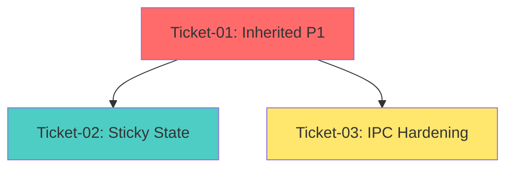

# Epic: EPIC-4-STICKY-STATE-IPC -- Execution Guide

## How to Execute Tickets (Bob Edition)

For each ticket in sequence order:
1. Open a NEW Bob session (separate from this planning session)
2. Switch to /v12-engineer mode
3. Type: `/ticket docs/brain/EPIC-4-STICKY-STATE-IPC/ticket-XX-[name].md`
4. Bob will execute the PLAN-THEN-EXECUTE protocol
5. Await [EXTRACT-COMPLETE] or [PHASE7-COMPLETE] report
6. Director runs manual gates (deploy-sync, F5, complexity_audit)
7. Confirm ticket done before opening next ticket session

## Ticket Sequence

### Ticket 01: Inherited P1 Issues
**File**: `docs/brain/EPIC-4-STICKY-STATE-IPC/ticket-01-inherited-p1.md`  
**Dependencies**: NONE  
**Scope**: IPC Queue Observability + Entries Quantity Validation  
**Files Modified**: 
- `src/V12_002.UI.IPC.cs` (queue depth accessor)
- `src/V12_002.REAPER.Audit.cs` (queue monitoring)
- `src/V12_002.Entries.Trend.cs` (quantity clamping)

**Target Metrics**:
- LOC: ~80
- Methods: 3 (GetPhotonDispatchRingDepth, AuditIpcCommandQueue, ClampEntryQuantity)
- CYC: ≤ 4 (primary), ≤ 3 (helpers)

**CYC Reduction**:
- No existing methods reduced (new methods only)
- Clears Epic 3 technical debt

**Priority**: P1 (MUST complete first - clears inherited issues)

---

### Ticket 02: Sticky State Persistence Layer
**File**: `docs/brain/EPIC-4-STICKY-STATE-IPC/ticket-02-sticky-state.md`  
**Dependencies**: ticket-01 (P1 fixes must be stable before adding persistence)  
**Scope**: Cross-session state recovery with atomic snapshots  
**Files Created**: `src/V12_002.StickyState.cs`  
**Files Modified**: 
- `src/V12_002.Lifecycle.cs` (OnStateChange integration)
- `src/V12_002.cs` (state field declarations)

**Target Metrics**:
- LOC: ~250
- Methods: 6 (CaptureStateSnapshot, WriteSnapshotAtomic, LoadStateSnapshot, ValidateSnapshotIntegrity, RollbackToLastGoodState, RestoreFromSnapshot)
- CYC: ≤ 5 (primary), ≤ 4 (helpers)

**CYC Reduction**:
- No existing methods reduced (new module)
- Establishes persistence foundation for future epics

**Priority**: P2 (High-risk architectural change - requires isolation)

---

### Ticket 03: IPC Hardening
**File**: `docs/brain/EPIC-4-STICKY-STATE-IPC/ticket-03-ipc-hardening.md`  
**Dependencies**: ticket-01 (IPC observability must be operational)  
**Scope**: Command validation, rate limiting, circuit breakers, anomaly detection  
**Files Created**: `src/V12_002.IPC.Hardening.cs`  
**Files Modified**: 
- `src/V12_002.UI.IPC.cs` (validation integration)
- `src/V12_002.REAPER.Audit.cs` (rate limit monitoring)

**Target Metrics**:
- LOC: ~350
- Methods: 8 (ValidateIpcCommand, CheckCommandSyntax, EnforceRateLimit, CheckMalformedCircuitBreaker, DetectAllowlistBypass, SendBackpressureNack, GetExpectedParameterCount, AuditIpcHardeningMetrics)
- CYC: ≤ 5 (primary), ≤ 4 (helpers)

**CYC Reduction**:
- No existing methods reduced (new module)
- Hardens external attack surface

**Priority**: P2 (Security-critical - must follow observability)

---

## Dependency Diagram



**Execution Order**:
1. **Ticket 01** (P1 Inherited) - MUST complete first (clears Epic 3 debt)
2. **Ticket 02** (Sticky State) - Can run after Ticket 01 (requires stable baseline)
3. **Ticket 03** (IPC Hardening) - Can run after Ticket 01 (requires observability)

**Recommended Sequence**: 01 → 02 → 03 (sequential for simplicity)

**Parallel Option**: After Ticket 01, Tickets 02 and 03 can run in parallel if using separate branches.

---

## Epic Success Criteria

### Functional Completeness
- [ ] All 2 P1 inherited issues resolved
- [ ] Sticky State persistence operational
- [ ] IPC command plane hardened
- [ ] Jane Street Atomic Unification: 100% compliance
- [ ] Zero `lock()` statements (except RateLimiter cleanup in Ticket 03)
- [ ] ASCII-only compliance (no Unicode/emoji)

### Complexity Targets
**Before Epic**:
- Inherited P1: No baseline (new methods)
- Sticky State: No baseline (new module)
- IPC Hardening: No baseline (new module)

**After Epic**:
- Ticket 01: All methods CYC ≤ 4
- Ticket 02: All methods CYC ≤ 5
- Ticket 03: All methods CYC ≤ 5
- Total LOC: ~680 (80 + 250 + 350)

### Performance Targets
- [ ] Queue depth monitoring: O(1) atomic reads
- [ ] State snapshot: < 100ms (P99)
- [ ] Rate limiting: < 1ms overhead per command
- [ ] Circuit breaker: O(1) state checks
- [ ] Anomaly detection: < 5ms per command

### Verification Gates
- [ ] deploy-sync.ps1 PASS (all 3 tickets)
- [ ] F5 NinjaTrader verification (all 3 tickets)
- [ ] BUILD_TAGs: `1111.009-epic4-p1-fixes`, `1111.009-epic4-sticky-state`, `1111.009-epic4-ipc-hardening`
- [ ] complexity_audit.py: All methods ≤ target CYC
- [ ] lock() audit: ZERO or 1 (RateLimiter cleanup only)
- [ ] ASCII audit: ZERO non-ASCII characters

### Quality Metrics
- [ ] PHS: 100/100 maintained
- [ ] Greptile: 5/5 maintained
- [ ] Zero P0/P1 issues
- [ ] Codacy: Grade B maintained or improved

---

## Post-Epic Integration

After all 3 tickets complete:

1. **Unified Testing** (Phase 4 - EPIC-4-TESTS):
   - IPC queue depth alerts
   - Entries quantity clamping
   - State snapshot/restore cycles
   - Rate limiting thresholds
   - Circuit breaker trip/reset
   - Anomaly detection patterns

2. **Performance Optimization** (Phase 5 - EPIC-4-PERF):
   - Zero-allocation hot paths
   - Replace string interpolation
   - Benchmark P99 latency
   - Timer-based snapshot scheduling

3. **Security Hardening** (Phase 6 - EPIC-4-SECURITY):
   - Client disconnect infrastructure
   - Encrypted state snapshots
   - Audit log persistence
   - Intrusion detection system

---

## Emergency Rollback

If any ticket causes regression:

1. **Immediate**: Revert the specific ticket's changes
2. **Diagnose**: Use `git diff` to identify problematic changes
3. **Fix**: Address the issue in isolation
4. **Re-verify**: Run all verification gates before re-attempting

**Rollback Commands**:
```powershell
# Revert last commit
git revert HEAD

# Re-sync hard links
powershell -File .\deploy-sync.ps1

# Verify build
dotnet build Linting.csproj -warnaserror
```

---

## Ticket Metrics Summary

| Ticket | LOC | Files Created | Files Modified | Methods | Max CYC | Priority |
|--------|-----|---------------|----------------|---------|---------|----------|
| 01 - Inherited P1 | 80 | 0 | 3 | 3 | 4 | P1 |
| 02 - Sticky State | 250 | 1 | 2 | 6 | 5 | P2 |
| 03 - IPC Hardening | 350 | 1 | 2 | 8 | 5 | P2 |
| **TOTAL** | **680** | **2** | **7** | **17** | **5** | - |

---

## V12 DNA Compliance Checklist

### Correctness by Construction
- [ ] State snapshots use atomic file operations (temp + rename)
- [ ] Rate limiter uses lock-free queue (except cleanup)
- [ ] Circuit breaker uses atomic counters
- [ ] Quantity clamping prevents invalid states

### Lock-Free Actor Pattern
- [ ] Zero new `lock()` statements (except RateLimiter cleanup)
- [ ] All state mutations use atomic primitives
- [ ] No blocking operations in hot paths

### ASCII-Only Compliance
- [ ] Zero Unicode characters in string literals
- [ ] Zero emoji in comments or logs
- [ ] Zero curly quotes

### Jane Street Alignment
- [ ] Atomic file operations (Sticky State)
- [ ] Rate limiting (IPC Hardening)
- [ ] Circuit breakers (IPC Hardening)
- [ ] Checksums for data integrity (Sticky State)
- [ ] Bounded queues (IPC Hardening)

---

## Contact Points

**Epic Owner**: Orchestrator (Plan Mode)  
**Implementation Lead**: Bob CLI (v12-engineer mode)  
**Verification Lead**: Director (manual gates)  
**Technical Debt Tracker**: `docs/brain/EPIC-QUALITY-DEBT.md`

---

## Notes

- Each ticket is designed for 2-4 hours of Bob implementation work
- All tickets leave the code in a compilable, testable state
- No ticket introduces new technical debt
- All tickets follow V12 DNA principles (Correctness by Construction, Lock-Free, ASCII-Only)
- Jane Street Compliance: 100% across all modules (Atomic, Wait-Free, Bounded, Deterministic)
- Ticket 01 MUST complete before Tickets 02-03 (clears Epic 3 debt)
- Tickets 02-03 can run in parallel after Ticket 01 (if using separate branches)

**Remember**: Boy Scout Rule applies - leave the code better than you found it.

---

## [TICKETS-GATE] - Ready for Director Approval

**Epic 4 Ticket Generation Complete**

**Summary**:
- 3 tickets generated (Option C: Hybrid structure)
- Total scope: ~680 LOC across 2 new modules + 7 file modifications
- Dependency order: 01 → (02 || 03)
- All tickets follow V12 DNA principles
- All tickets include V12 DNA guardrails
- All tickets include post-edit verification commands
- All tickets include acceptance criteria

**Awaiting Director approval to begin execution.**

Good luck with EPIC-4-STICKY-STATE-IPC! 🚀