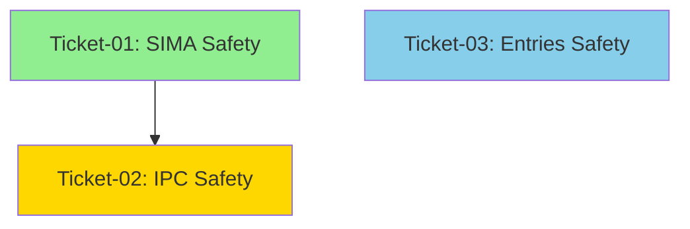

# Epic: REAPER-EXPANSION -- Execution Guide

## How to Execute Tickets (Bob Edition)

For each ticket in sequence order:
1. Open a NEW Bob session (separate from this planning session)
2. Switch to /v12-engineer mode
3. Type: `/ticket docs/brain/REAPER-EXPANSION/ticket-XX-[name].md`
4. Bob will execute the PLAN-THEN-EXECUTE protocol
5. Await [EXTRACT-COMPLETE] or [PHASE7-COMPLETE] report
6. Director runs manual gates (deploy-sync, F5, complexity_audit)
7. Confirm ticket done before opening next ticket session

## Ticket Sequence

### Ticket 01: SIMA Safety Module
**File**: `docs/brain/REAPER-EXPANSION/ticket-01-sima-safety.md`  
**Dependencies**: NONE  
**Scope**: Fleet dispatch queue safety layer  
**Files Created**: `src/V12_002.REAPER.SIMA.cs`  
**Files Modified**: 
- `src/V12_002.REAPER.Audit.cs` (integration)
- `src/V12_002.SIMA.Fleet.cs` (stale dispatch check)
- `src/V12_002.SIMA.Dispatch.cs` (toggle gate tracking)

**Target Metrics**:
- LOC: ~180
- Methods: 4 (AuditFleetDispatchQueue, CheckStaleDispatch, AuditSymmetryContext, AuditSimaToggleGate)
- CYC: ≤ 5 (primary), ≤ 4 (helpers)

**CYC Reduction**:
- No existing methods reduced (new module)
- Prevents future complexity growth via bounded queue monitoring

---

### Ticket 02: IPC Safety Module
**File**: `docs/brain/REAPER-EXPANSION/ticket-02-ipc-safety.md`  
**Dependencies**: ticket-01 (shares REAPER audit cycle integration pattern)  
**Scope**: IPC command queue safety layer  
**Files Created**: `src/V12_002.REAPER.IPC.cs`  
**Files Modified**: 
- `src/V12_002.REAPER.Audit.cs` (integration)
- `src/V12_002.UI.IPC.cs` (stale command check)

**Target Metrics**:
- LOC: ~150
- Methods: 4 (AuditIpcCommandQueue, CheckStaleIpcCommand, AuditMalformedPayloadRate, AuditAllowlistBypassRate)
- CYC: ≤ 5 (primary), ≤ 4 (helpers)

**CYC Reduction**:
- No existing methods reduced (new module)
- Prevents DoS attack surface via backpressure monitoring

---

### Ticket 03: Entries Safety Module
**File**: `docs/brain/REAPER-EXPANSION/ticket-03-entries-safety.md`  
**Dependencies**: NONE (independent of Tickets 01-02)  
**Scope**: Entry signal validation and duplicate suppression  
**Files Created**: `src/V12_002.REAPER.Entries.cs`  
**Files Modified**: 
- `src/V12_002.Entries.OR.cs` (ExecuteLong, ExecuteShort)
- `src/V12_002.Entries.RMA.cs` (ExecuteTrendSplitEntry)
- `src/V12_002.Entries.MOMO.cs` (ExecuteMOMOEntry)
- `src/V12_002.Entries.FFMA.cs` (ExecuteFFMAEntry)
- `src/V12_002.Entries.Trend.cs` (ExecuteTRENDEntry)
- `src/V12_002.Entries.Retest.cs` (ExecuteRetestEntry)

**Target Metrics**:
- LOC: ~120
- Methods: 5 (ValidateEntryPreconditions, ValidateEntryMode, CheckDuplicateSignal, CheckSignalStaleness, ValidateEntryQuantity)
- CYC: ≤ 5 (primary), ≤ 3 (helpers)

**CYC Reduction**:
- No existing methods reduced (new module)
- Prevents duplicate signal flooding via atomic timestamp tracking

---

## Dependency Diagram



**Execution Order**:
1. **Ticket 01** (SIMA) - MUST complete first (establishes REAPER audit cycle pattern)
2. **Ticket 02** (IPC) - Depends on Ticket 01 (reuses audit integration pattern)
3. **Ticket 03** (Entries) - Can run in parallel with Ticket 02 (independent)

**Recommended Sequence**: 01 → 02 → 03 (sequential for simplicity)

---

## Epic Success Criteria

### Functional Completeness
- [ ] All 12 safety gaps addressed (4 SIMA, 4 IPC, 4 Entries)
- [ ] Jane Street Atomic Unification: 100% compliance
- [ ] Zero `lock()` statements across all modules
- [ ] ASCII-only compliance (no Unicode/emoji)

### Complexity Targets
**Before Epic**:
- SIMA: No baseline (new module)
- IPC: No baseline (new module)
- Entries: No baseline (new module)

**After Epic**:
- SIMA: All methods CYC ≤ 5
- IPC: All methods CYC ≤ 5
- Entries: All methods CYC ≤ 5
- Total LOC: ~450 (180 + 150 + 120)

### Performance Targets
- [ ] All checks complete in < 10ms (P99)
- [ ] Queue depth monitoring: O(1) atomic reads
- [ ] Duplicate suppression: O(1) CAS operations
- [ ] Staleness checks: O(1) timestamp comparisons

### Verification Gates
- [ ] deploy-sync.ps1 PASS (all 3 tickets)
- [ ] F5 NinjaTrader verification (all 3 tickets)
- [ ] BUILD_TAGs: `1111.008-reaper-expansion-t1/t2/t3`
- [ ] complexity_audit.py: All methods ≤ target CYC
- [ ] lock() audit: ZERO matches
- [ ] ASCII audit: ZERO non-ASCII characters

---

## Post-Epic Integration

After all 3 tickets complete:

1. **Unified Testing** (Phase 4 - EPIC-REAPER-TESTS):
   - Circuit breaker trip/reset thresholds
   - Stale dispatch/command detection
   - Duplicate signal suppression
   - Cross-module integration

2. **Performance Optimization** (Phase 5 - EPIC-REAPER-PERF):
   - Zero-allocation hot path
   - Replace string interpolation
   - Benchmark P99 latency

3. **CI Integration** (Phase 6 - EPIC-CI-COMPILATION):
   - NinjaTrader in GitHub Actions
   - StyleCop CI workflow
   - Codacy Coverage workflow

---

## Emergency Rollback

If any ticket causes regression:

1. **Immediate**: Revert the specific ticket's changes
2. **Diagnose**: Use `git diff` to identify problematic changes
3. **Fix**: Address the issue in isolation
4. **Re-verify**: Run all verification gates before re-attempting

**Rollback Commands**:
```powershell
# Revert last commit
git revert HEAD

# Re-sync hard links
powershell -File .\deploy-sync.ps1

# Verify build
dotnet build Linting.csproj -warnaserror
```

---

## Contact Points

**Epic Owner**: Orchestrator (Plan Mode)  
**Implementation Lead**: Bob CLI (v12-engineer mode)  
**Verification Lead**: Director (manual gates)  
**Technical Debt Tracker**: `docs/brain/EPIC-QUALITY-DEBT.md`

---

## Notes

- Each ticket is designed for 1-2 hours of Bob implementation work
- All tickets leave the code in a compilable, testable state
- No ticket introduces new technical debt
- All tickets follow V12 DNA principles (Correctness by Construction, Lock-Free, ASCII-Only)
- Jane Street Compliance: 100% across all modules (Atomic, Wait-Free, Bounded, Deterministic)

**Remember**: Boy Scout Rule applies - leave the code better than you found it.

Good luck with REAPER-EXPANSION! 🚀