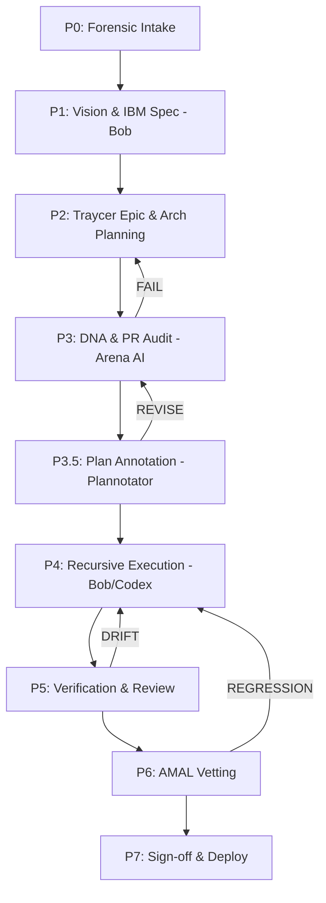

# V12 Sovereign Workflow Manifesto
**Version**: 16.0 (Photon Multi-Engineer Edition)
**Mission**: Universal OR Strategy Refactoring
**Status**: ACTIVE

---

## 1. The Recursive Execution Protocol (P0-P7)

Our workflow follows a strict 7-stage lifecycle to ensure **Correctness by Construction** and **Metabolic Elegance**.

### Stage Definitions:
*   **P0: Forensics**: Discovery of logic drift or bug evidence using `jcodemunch` and `graphify`.
*   **P1: Vision & IBM Spec (Bob)**: Using **Bob's Spec Kit** to define technical requirements and the "IBM-Standard Specification" for the mission.
*   **P2: Traycer Epic & Arch Planning**: Formalizing the spec into a **Traycer Epic** and generating the `implementation_plan.md` (PLAN-ONLY) with the Architect.
*   **P3: DNA & PR Audit (Arena AI)**: Mandatory adversarial review and consensus using **Arena AI** (Red Team) to verify lock-free, ASCII, and PR health before implementation.
*   **P3.5: Plan Annotation (Plannotator)**: Annotating the approved `implementation_plan.md` with file-specific logic markers, line-precision targets, and DNA-enforcement triggers for the Engineer CLI.
*   **P4: Execution**: Surgical implementation using the selected **Engineer CLI**.
*   **P5: Verification**: Forensic check against the plan.
*   **P6: AMAL Vetting**: Performance and allocation audit via `scripts/amal_harness.py`.
*   **P7: Sign-off**: Final synchronization via `deploy-sync.ps1`.

---

## 2. The Agent Swarm Hierarchy

We leverage a distributed intelligence model to maximize productivity and efficiency.

| Role | Agent | Mode / Tool | Responsibility |
| :--- | :--- | :--- | :--- |
| **P1: Orchestrator** | Antigravity | Central Switchboard | Context management, tool routing, and mission oversight. |
| **P3: Architect** | Claude Code | PLAN-ONLY | Structural design and implementation plans. **BANNED from `src/` edits.** |
| **P3.5: Planner** | **Plannotator** | Plan Integration | Annotating implementation plans with surgical precision metadata. |
| **P4: Surgical Engineer** | **IBM Bob CLI** | `v12-engineer` | SIMA extractions, God-Function splits, and complex C# refactors. |
| **P4: Logic Engineer** | Codex CLI | `codex-rescue` | Logic hardening, Lock-free updates, and concurrent state repairs. |
| **P4: Utility Specialist** | **Gemini CLI** | `yolo` | **Utility Specialist & Research Hub**. Handles non-`src/` tasks (docs, infra, configs), model-agnostic operations, **Official Web Research**, and **Video Synthesis** to conserve specialized tokens. |
| **P6: Auditor / Adjudicator** | Jules / **Arena AI** | `/review` / `$battle` | Adversarial audit, PR vetting, and DNA compliance check. |

---

## 3. Toolset & Spec Kit Usage

### ⚙️ Unified Tooling Mandate
To maintain architectural parity, ALL agents (including **Rovo Dev** and **Cursor AI**) must have access to the full project toolset:
- **jCodemunch-MCP**: Primary suite for codebase navigation and forensic trace.
- **Context7 CLI**: Specialist tool for deep documentation and API research.
- **Graphify**: Universal knowledge graph layer.
- **Plannotator**: High-precision plan annotation and metadata bridge.
- **Nexus Bridge**: Inter-agent state relay.
- **MultiCA**: Multi-Agent Control & Audit (Orchestration logic).
- **Linear / GitHub**: Project management and source of truth.

### 🛰️ Traycer (Epic & Phase Management)
*   **Epics**: High-level mission containers (e.g., `Phase 6 Hot Path Extraction`).
*   **Tickets**: Discrete, atomic tasks within an Epic (e.g., `T2.A - ProcessOnExecutionUpdate`).
*   **Phases**: Sequential stages of a ticket (Plan -> Review -> Execution -> Verify).
*   **Handoff Menu**: The primary interface for routing ticket context to the Engineer CLIs.

### 🤖 IBM Bob CLI (V12 Specialist)
*   **Spec Kit**: Integrated support for IBM-standard specifications and high-autonomy engineering.
*   **Modes**:
    *   `/plan`: Strategy and task decomposition.
    *   `/code`: Direct implementation and refactoring.
    *   `/ask`: Codebase navigation and Q&A.
*   **Features**: Automated checkpointing, `/restore` functionality, and V12 DNA rule enforcement.

### ⚙️ Gemini CLI (Efficiency & Research Hub)
*   **Token Strategy**: Gemini handles all "Utility" tasks to preserve specialized tokens for Claude/Bob/Codex.
*   **Official Web Research**: Designated specialist for Tavily/Crawl/Search operations to gather forensic evidence.
*   **Video Synthesis**: Official specialist for synthesizing video content (visual/audio/transcripts) into structured project context.
*   **Scope**: `docs/`, `scripts/`, `.github/`, `package.json`, and all model-agnostic terminal operations.
*   **Role**: Handles all non-src and utility tasks **EXCEPT** high-value logic reports like `$prreport` or `$battlezip`.

---

## 4. Operational Handoff Procedures

### The 3 Ways to Handoff to CLI:
1.  **Traycer "Handoff To" Menu**: High-context handoff from Epic/Ticket view.
2.  **CLI Agents Sidebar**: Direct manual trigger for tool-based operations.
3.  **Terminal Piping**: Piping raw context via `Get-Content | cli-agent.bat`.

### Mandatory Post-Edit Sequence:
After ANY modification to `src/` files, the Engineer MUST:
1.  Run `powershell -File .\deploy-sync.ps1` (Re-establish hard links + ASCII Gate).
2.  Instruct Director: "Press F5 in NinjaTrader to compile."
3.  Verify the **BUILD_TAG** banner in the NinjaTrader output.

---

## 5. Standard Commands & Workflows

### 🛠️ Standard Commands
*   **Build & Sync**: `powershell -File .\scripts\build_readiness.ps1`
*   **Lint Audit**: `powershell -File .\scripts\lint.ps1`
*   **Hard Link Sync**: `powershell -File .\deploy-sync.ps1`
*   **Sovereign Audit**: `droid /review`
*   **PR Audit Report**: `$prreport` (High-value logic synthesis - **Director/Architect only**)
*   **Architectural Battle**: `$battlezip` / `$battle` (Complex conflict resolution)

### 🔗 Workflow Registry
Click to open the official procedure for each workflow:
*   [Agent-as-Tool](../../_agents/workflows/agent_as_tool.md) - Stateless single-use tool invocation.
*   [Architect Intake](../../_agents/workflows/architect_intake.md) - Formalizing P0 forensics into P3 designs.
*   [Architectural Battle](../../_agents/workflows/battle.md) - Compounding intelligence via Arena AI.
*   [Coordinator](../../.agent/workflows/coordinator.md) - Hierarchical task decomposition.
*   [Hardened Adjudication](../../_agents/workflows/hardened_adjudication.md) - Re-auditing plans after logic drift.
*   [Loop Critic](../../_agents/workflows/loop_critic.md) - Review & Critique loop until sign-off.
*   [Mission Validate](../../.agent/workflows/mission-validate.md) - Independent P6 validation.
*   [Multi-Agent Audit](../../.agent/workflows/multi_agent_audit.md) - Red Team "Adversarial" auditing.
*   [Nexus Relay](../../.agent/workflows/nexus-relay.md) - P5 Mission Control handoff.
*   [PR Report](../../.agent/workflows/pr_report.md) - Generating the `$prreport` status summary.

---

## 6. Token Efficiency Policy
> **"IQ Tokens for Logic, EQ Tokens for Utility."**
*   **Claude** is for Design only.
*   **Bob/Codex** are for Surgical Code only.
*   **Gemini** is the workhorse for everything else.

---
**Document Owner**: Antigravity Orchestrator
**Last Audit**: 2026-05-09
