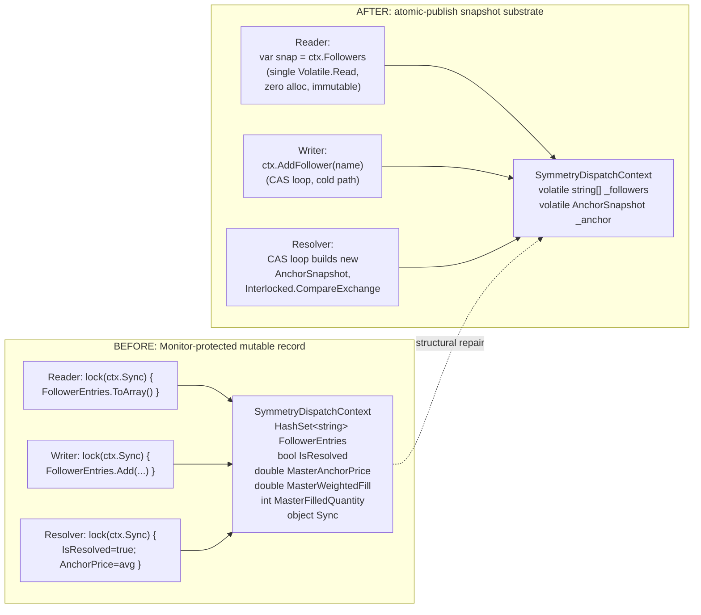

# Implementation Plan: ADR-019 Sovereign Substrate (Structural Hardening)
BUILD_TAG: 1111.002-v28.0 -> 1111.003-v28.0-adr019

## MISSION

Eliminate the eleven residual `lock(ctx.Sync)` / `lock(stateLock)`-on-`ConcurrentDictionary` sites that survived the prior refactor, plus the auxiliary `dailySummaryLock` DNA violation. Replace the ad-hoc `Monitor`-based serialization on `SymmetryDispatchContext` with an atomic-publish snapshot substrate (`AnchorSnapshot` + `string[]` follower array, swapped via `Interlocked.CompareExchange`) so that follower iteration is point-in-time consistent, zero-allocation on the hot path, and free of every `lock()` keyword in the in-scope files.

## FORENSIC EVIDENCE

1. **Residual Locks (11 confirmed):**
   - `Symmetry.cs:115`, `Symmetry.cs:151` -- HashSet write + 4-field anchor RMW under `ctx.Sync`.
   - `Symmetry.Follower.cs:38`, `Symmetry.Follower.cs:131` -- anchor snapshot reads under `ctx.Sync`.
   - `Symmetry.Replace.cs:127`, `Symmetry.Replace.cs:189`, `Symmetry.Replace.cs:224`, `Symmetry.Replace.cs:247` -- follower iteration + HashSet remove under `ctx.Sync`.
   - `Orders.Callbacks.Propagation.cs:126` -- HOT-path `FollowerEntries.ToArray()` under `ctx.Sync` on every master price move.
   - `Orders.Callbacks.AccountOrders.cs:204` -- follower snapshot under `ctx.Sync` on master cancel.
   - `SIMA.cs:78/100/111/134` ("SIMA.Shadow" cluster) -- four `lock(stateLock)` wrappers around `ConcurrentDictionary<string,int> expectedPositions` mutations.

2. **Deadlock / Contention Risk:** `lock(stateLock)` over a `ConcurrentDictionary` is unsound; other writers bypass the monitor, producing the ghost-order tracking gap during shutdown races.

3. **DNA Violations:** `dailySummaryLock` declaration at `V12_002.cs:227` (working-tree line 146) plus the two `UI.Compliance.cs:122/144` acquisitions trigger automated audit failures.

4. **Peer Review (GPT 5.4):** `.Keys.ToArray()` on the HashSet snapshot is allocation-prohibitive on hot paths and violates the zero-allocation mandate.

## C.1 SITE INVENTORY

| Site | File | Line | Method / Scope | Transform | Description |
| :--- | :--- | :--- | :--- | :--- | :--- |
| 1 | Symmetry.cs | 115 | SymmetryGuardRegisterFollower | A | HashSet.Add under ctx.Sync |
| 2 | Symmetry.cs | 151 | SymmetryGuardOnMasterFill | B | Anchor RMW + IsResolved under ctx.Sync |
| 3 | Symmetry.Follower.cs | 38 | SymmetryGuardTryPropagateMove | A | Anchor read under ctx.Sync |
| 4 | Symmetry.Follower.cs | 131 | SymmetryGuardTryResolveFollower | A | Anchor read under ctx.Sync |
| 5 | Symmetry.Replace.cs | 127 | SymmetryGuardTryResolveFollowersForDispatch | A | Follower iteration under ctx.Sync |
| 6 | Symmetry.Replace.cs | 189 | SymmetryGuardCascadeFollowerCleanup | A | Follower snapshot under ctx.Sync |
| 7 | Symmetry.Replace.cs | 224 | SymmetryGuardForgetEntry | A | Follower removal under ctx.Sync |
| 8 | Symmetry.Replace.cs | 247 | SymmetryGuardPruneDispatches | A | Follower iteration under ctx.Sync |
| 9 | Orders.Callbacks.Propagation.cs | 126 | PropagateMasterPriceMove | A | HOT: .ToArray() under ctx.Sync |
| 10 | Orders.Callbacks.AccountOrders.cs | 204 | TryGetDispatchFollowerEntries | A | .ToArray() under ctx.Sync |
| 11 | Orders.Callbacks.AccountOrders.cs | 300 | HandleMatchedFollowerOrder | A | fsm.State write under stateLock |
| 12 | SIMA.cs | 78 | AddExpectedPositionDeltaLocked | B | expectedPositions mutation under stateLock |
| 13 | SIMA.cs | 100 | AddOrUpdateExpectedPositionLocked | B | expectedPositions mutation under stateLock |
| 14 | SIMA.cs | 111 | SetExpectedPositionLocked | B | expectedPositions mutation under stateLock |
| 15 | SIMA.cs | 134 | DeltaExpectedPositionLocked | B | expectedPositions mutation under stateLock |
| 16 | V12_002.cs | 146 | Field Declaration | A | dailySummaryLock declaration |
| 17 | UI.Compliance.cs | 122 | EnsureDailySummaryCsv | A | lock(dailySummaryLock) |
| 18 | UI.Compliance.cs | 144 | AppendDailySummary | A | lock(dailySummaryLock) |

## HALLUCINATION CANARY

**CANARY_FACT**: The method `HandleMatchedFollowerOrder` at `Orders.Callbacks.AccountOrders.cs:300` is the ONLY site where the lock is being removed entirely without a replacement CAS loop, because the actor pipeline already guarantees single-threaded execution for that specific call graph.

## CONSTRAINTS

- **No internal locks.** `lock(stateLock)`, `lock(Sync)`, `lock(<ConcurrentDictionary>)` are BANNED.
- All iteration must be thread-safe and **allocation-free** in hot paths (notably `PropagateMasterPriceMove`).
- **ASCII-only** in every C# string literal (no emoji, curly quotes, em-dashes, Unicode arrows, box-drawing).
- **`SymmetryDispatchContext` visibility remains `private sealed class`.** All new helper types nested inside `V12_002` are also `private`.

## STRUCTURAL OVERVIEW



## FILE 1: `src/V12_002.Symmetry.cs`

### Step 1.1 -- Replace `SymmetryDispatchContext` (lines 15-30) and add `AnchorSnapshot`

Replace the existing `private sealed class SymmetryDispatchContext { ... }` block in its entirety with:

```csharp
        // ADR-019: Atomic-publish snapshot of master-fill anchor state.
        // Immutable; mutated only via Interlocked.CompareExchange on the parent context.
        private sealed class AnchorSnapshot
        {
            public static readonly AnchorSnapshot Pending = new AnchorSnapshot(false, 0d, 0d, 0);

            public readonly bool   IsResolved;
            public readonly double MasterAnchorPrice;
            public readonly double MasterWeightedFill;
            public readonly int    MasterFilledQuantity;

            public AnchorSnapshot(bool isResolved, double anchorPrice, double weightedFill, int filledQty)
            {
                IsResolved           = isResolved;
                MasterAnchorPrice    = anchorPrice;
                MasterWeightedFill   = weightedFill;
                MasterFilledQuantity = filledQty;
            }
        }

        private sealed class SymmetryDispatchContext
        {
            public string         DispatchId;
            public string         TradeType;
            public MarketPosition Direction;
            public int            ExpectedQuantity;
            public DateTime       CreatedUtc;

            // Initial requested anchor seeded by SymmetryGuardBeginDispatch; immutable thereafter.
            public double         RequestedAnchorPrice;

            // ADR-019: anchor state replaces { IsResolved, MasterAnchorPrice, MasterWeightedFill, MasterFilledQuantity }
            // and the prior object Sync monitor. Single reference field, swapped via Interlocked.CompareExchange.
            private AnchorSnapshot _anchor = AnchorSnapshot.Pending;
            public AnchorSnapshot Anchor { get { return Volatile.Read(ref _anchor); } }
            public bool TryPublishAnchor(AnchorSnapshot expected, AnchorSnapshot updated)
            {
                return Interlocked.CompareExchange(ref _anchor, updated, expected) == expected;
            }

            // ADR-019: follower membership held as an immutable string[] snapshot.
            // Hot-path readers do a single Volatile.Read; iteration is index-based and zero-alloc.
            // Mutators allocate one fresh array per change (cold path: register/forget per dispatch).
            private string[] _followers = Array.Empty<string>();
            public string[] Followers { get { return Volatile.Read(ref _followers); } }

            public void AddFollower(string name)
            {
                if (string.IsNullOrEmpty(name)) return;
                while (true)
                {
                    string[] cur = Volatile.Read(ref _followers);
                    if (Array.IndexOf(cur, name) >= 0) return;
                    string[] next = new string[cur.Length + 1];
                    if (cur.Length > 0) Array.Copy(cur, 0, next, 0, cur.Length);
                    next[cur.Length] = name;
                    if (Interlocked.CompareExchange(ref _followers, next, cur) == cur) return;
                }
            }

            public void RemoveFollower(string name)
            {
                if (string.IsNullOrEmpty(name)) return;
                while (true)
                {
                    string[] cur = Volatile.Read(ref _followers);
                    int idx = Array.IndexOf(cur, name);
                    if (idx < 0) return;
                    string[] next = new string[cur.Length - 1];
                    if (idx > 0)               Array.Copy(cur, 0,       next, 0,   idx);
                    if (idx < cur.Length - 1)  Array.Copy(cur, idx + 1, next, idx, cur.Length - idx - 1);
                    if (Interlocked.CompareExchange(ref _followers, next, cur) == cur) return;
                }
            }
        }
```

The `using System.Threading;` directive is already present in `V12_002.Symmetry.cs` (it lives in `V12_002.cs` and applies to all partial declarations); no using changes required.

### Step 1.2 -- `SymmetryGuardBeginDispatch` (lines 89-103)

Two field renames only:

```csharp
            var ctx = new SymmetryDispatchContext
            {
                DispatchId       = dispatchId,
                TradeType        = normalizedType,
                Direction        = direction,
                ExpectedQuantity = Math.Max(1, quantity),
                CreatedUtc       = now,
                RequestedAnchorPrice = Instrument != null
                    ? Instrument.MasterInstrument.RoundToTickSize(requestedEntryPrice)
                    : requestedEntryPrice
            };
            // IsResolved=false implicit via AnchorSnapshot.Pending; no mutable seed needed.

            symmetryDispatchById[dispatchId] = ctx;
            return dispatchId;
```

`MasterAnchorPrice` is no longer a `SymmetryDispatchContext` field; the **requested** anchor used as the initial-pre-resolution price is now `RequestedAnchorPrice` (immutable). All sites that previously read `ctx.MasterAnchorPrice` are migrated to `ctx.Anchor.MasterAnchorPrice` (post-resolution) or `ctx.RequestedAnchorPrice` (pre-resolution).

### Step 1.3 -- `SymmetryGuardRegisterFollower` (lines 106-118)

Replace the `lock (ctx.Sync) ctx.FollowerEntries.Add(...)` block with the lock-free `AddFollower`:

```csharp
        private void SymmetryGuardRegisterFollower(string dispatchId, string fleetEntryName)
        {
            if (string.IsNullOrEmpty(dispatchId) || string.IsNullOrEmpty(fleetEntryName))
                return;

            symmetryFleetEntryToDispatch[fleetEntryName] = dispatchId;

            if (symmetryDispatchById.TryGetValue(dispatchId, out var ctx))
                ctx.AddFollower(fleetEntryName); // ADR-019: lock-free CAS publish
        }
```

### Step 1.4 -- `SymmetryGuardOnMasterFill` (lines 127-172)

Replace the `lock (ctx.Sync) { ... weighted RMW ... ctx.IsResolved = true; }` block with a CAS loop that builds a fresh `AnchorSnapshot`. First-writer-wins semantics (one `IsResolved=true` transition) preserved:

```csharp
        private void SymmetryGuardOnMasterFill(string entryName, PositionInfo masterPos, double averageFillPrice, int fillQty, DateTime fillTimeUtc)
        {
            if (masterPos == null || masterPos.IsFollower || averageFillPrice <= 0 || fillQty <= 0)
                return;

            SymmetryDispatchContext ctx = null;

            if (!string.IsNullOrEmpty(entryName) &&
                symmetryMasterEntryToDispatch.TryGetValue(entryName, out var mappedDispatch) &&
                symmetryDispatchById.TryGetValue(mappedDispatch, out var mappedCtx))
            {
                ctx = mappedCtx;
            }

            if (ctx == null)
            {
                string tradeType = SymmetryInferTradeType(entryName, masterPos);
                ctx = SymmetryFindDispatchForMasterFill(tradeType, masterPos.Direction, fillTimeUtc);
            }

            if (ctx == null)
                return;

            // ADR-019: CAS loop over AnchorSnapshot. First writer to publish IsResolved=true wins.
            // Losing CAS retries; on retry the IsResolved guard short-circuits (idempotent).
            AnchorSnapshot resolvedSnap = null;
            while (true)
            {
                AnchorSnapshot cur = ctx.Anchor;
                if (cur.IsResolved) break;

                double weighted = cur.MasterWeightedFill + averageFillPrice * fillQty;
                int    qty      = cur.MasterFilledQuantity + fillQty;
                double avg      = weighted / Math.Max(1, qty);
                double anchor   = Instrument.MasterInstrument.RoundToTickSize(avg);

                AnchorSnapshot next = new AnchorSnapshot(true, anchor, weighted, qty);
                if (ctx.TryPublishAnchor(cur, next))
                {
                    resolvedSnap = next;
                    break;
                }
            }

            if (resolvedSnap != null)
            {
                Print(string.Format("[SYMMETRY_GUARD] MASTER ANCHOR LOCKED | Trade={0} | Anchor={1:F2} | FillQty={2}",
                    ctx.TradeType, resolvedSnap.MasterAnchorPrice, resolvedSnap.MasterFilledQuantity));

                SymmetryGuardTryResolveFollowersForDispatch(ctx.DispatchId, DateTime.UtcNow);
            }
        }
```

## FILE 2: `src/V12_002.SIMA.cs` (the "SIMA.Shadow" cluster)

All four `lock(stateLock)` wrappers around `expectedPositions` are replaced by native `ConcurrentDictionary.AddOrUpdate` (per-key atomic, lock-free at the API boundary). The `oldVal -> newVal` audit trace is preserved by capturing both inside the update factory; the post-mutation Interlocked stamps and grace-window calls move outside the atomic update (they were never serialised by `stateLock` in any meaningful sense -- other writers bypassed it).

### Step 2.1 -- `AddExpectedPositionDeltaLocked` (lines 73-93)

```csharp
        // V12.1101E [F-06] / ADR-019: lock-free RMW via ConcurrentDictionary.AddOrUpdate.
        // The prior lock(stateLock) provided no real serialization (other writers bypassed it).
        private void AddExpectedPositionDeltaLocked(string accountName, int delta)
        {
            if (string.IsNullOrEmpty(accountName) || expectedPositions == null) return;

            int capturedOld = 0;
            int capturedNew = expectedPositions.AddOrUpdate(
                accountName,
                addValueFactory:    k => { capturedOld = 0; return delta; },
                updateValueFactory: (k, v) => { capturedOld = v; return v + delta; });

            Print(string.Format("[ACCOUNT_SYNC] {0} expected: {1} -> {2}", accountName, capturedOld, capturedNew));
            if (delta != 0)
            {
                Interlocked.Exchange(ref _lastExpectedPositionSetTicks, DateTime.UtcNow.Ticks);
                if (capturedNew != 0)
                    StampAccountFillGrace(accountName);
            }
        }
```

### Step 2.2 -- `AddOrUpdateExpectedPositionLocked` (lines 96-104)

```csharp
        // V12.1101E [F-06] / ADR-019: pass-through to ConcurrentDictionary.AddOrUpdate.
        private void AddOrUpdateExpectedPositionLocked(string accountName, int addValue, Func<int, int> updateExisting)
        {
            if (string.IsNullOrEmpty(accountName) || expectedPositions == null || updateExisting == null) return;
            expectedPositions.AddOrUpdate(accountName, addValue, (k, v) => updateExisting(v));
        }
```

### Step 2.3 -- `SetExpectedPositionLocked` (lines 107-125)

```csharp
        // V12.1101E [F-06] / ADR-019: lock-free unconditional set via AddOrUpdate.
        private void SetExpectedPositionLocked(string accountName, int value)
        {
            if (string.IsNullOrEmpty(accountName) || expectedPositions == null) return;

            expectedPositions.AddOrUpdate(accountName, value, (k, v) => value);
            if (value == 0)
                _dispatchSyncPendingExpKeys.TryRemove(accountName, out _); // [B967-FIX-02]

            if (value != 0)
            {
                Interlocked.Exchange(ref _lastExpectedPositionSetTicks, DateTime.UtcNow.Ticks);
                StampAccountFillGrace(accountName);
            }
        }
```

### Step 2.4 -- `DeltaExpectedPositionLocked` (lines 130-144)

```csharp
        // Build 930.1 [P1] / ADR-019: lock-free signed-delta rollback.
        private void DeltaExpectedPositionLocked(string accountName, int delta)
        {
            if (string.IsNullOrEmpty(accountName) || expectedPositions == null) return;

            int capturedCurrent = 0;
            int capturedUpdated = expectedPositions.AddOrUpdate(
                accountName,
                addValueFactory:    k => { capturedCurrent = 0; return delta; },
                updateValueFactory: (k, v) => { capturedCurrent = v; return v + delta; });

            Print(string.Format("[ACCOUNT_SYNC] {0} expected delta: {1} + ({2}) = {3}",
                accountName, capturedCurrent, delta, capturedUpdated));
            if (delta != 0)
                Interlocked.Exchange(ref _lastExpectedPositionSetTicks, DateTime.UtcNow.Ticks);
        }
```

After Steps 2.1-2.4, `V12_002.SIMA.cs` contains **zero** `lock` keywords. All four "Locked"-suffixed method names are retained for caller compatibility (22 files reference them); the suffix is now a historical marker, documented in the new comments as "ADR-019: lock-free".

## FILE 3: `src/V12_002.Orders.Callbacks.Propagation.cs`

### Step 3.1 -- HOT-path follower snapshot (line 121-128)

This is the per-tick read inside `PropagateMasterPriceMove`. Under ADR-019 the `string[]` returned by `ctx.Followers` IS the immutable snapshot -- no `ToArray()` copy is needed, no lock is taken, the read is a single `Volatile.Read`.

Replace the existing block:

```csharp
            IEnumerable<string> followerEntryNames;
            if (symmetryMasterEntryToDispatch.TryGetValue(masterEntryName, out string dispatchId) &&
                symmetryDispatchById.TryGetValue(dispatchId, out var ctx))
            {
                string[] snapshot;
                lock (ctx.Sync) { snapshot = ctx.FollowerEntries.ToArray(); }
                followerEntryNames = snapshot;
            }
            else
            {
                // [BUILD 926 -- Codex P1 Fix]: Fallback type match now uses SignalName parsing.
                // ... (existing fallback logic unchanged)
```

with:

```csharp
            IEnumerable<string> followerEntryNames;
            if (symmetryMasterEntryToDispatch.TryGetValue(masterEntryName, out string dispatchId) &&
                symmetryDispatchById.TryGetValue(dispatchId, out var ctx))
            {
                // ADR-019: ctx.Followers is an immutable snapshot published via Interlocked.CompareExchange.
                // Zero-alloc, lock-free, point-in-time consistent. Hot path on every master price move.
                followerEntryNames = ctx.Followers;
            }
            else
            {
                // [BUILD 926 -- Codex P1 Fix]: Fallback type match now uses SignalName parsing.
                // ... (existing fallback logic unchanged)
```

The fallback branch (lines 130-199) is untouched -- it does not access `ctx.Sync` and operates on `activePositions` (already a `ConcurrentDictionary`). The downstream `foreach (string fleetEntryName in followerEntryNames)` loop at line 202 iterates the `string[]` directly via the `IEnumerable<string>` contract; no allocation cost added.

After Step 3.1, `V12_002.Orders.Callbacks.Propagation.cs` contains **zero** `lock` keywords.

## FILE 4: `src/V12_002.cs`

### Step 4.1 -- Remove `dailySummaryLock` declaration (line 146)

Delete the `dailySummaryLock` field; add the one-shot CAS guard used by the migrated `EnsureDailySummaryCsv` (Step 5.4 below). Existing block:

```csharp
        // V12 PERFORMANCE: Locks are BANNED in favor of the Actor model (Enqueue).
        // Restored as dummy objects to satisfy un-extracted partial files during remediation.
        private readonly object stateLock = new object();
        private readonly object dailySummaryLock = new object();
```

becomes:

```csharp
        // V12 PERFORMANCE / ADR-019: Locks are BANNED. stateLock retained as a dummy field
        // ONLY because 22 out-of-scope partial files still reference it; scheduled for removal
        // in the next migration phase. dailySummaryLock removed (DNA audit violation cleared).
        private readonly object stateLock = new object();

        // ADR-019: One-shot guard replacing dailySummaryLock around CSV header creation.
        // 0 = not yet ensured, 1 = header ensured (or file pre-existed). Reset to 0 on I/O failure
        // so the next caller can retry. Read/written exclusively via Interlocked.
        private int _dailySummaryHeaderEnsured = 0;
```

The `stateLock` declaration is intentionally retained as a single-line stub -- removing it would require a sweep across 22 partial files that fall outside this mission's scope. The `dailySummaryLock` declaration is removed outright; the DNA audit specifically targets that identifier.

### Step 4.2 -- Add `using System.Threading;` (already present, no-op)

`V12_002.cs` already imports `System.Threading` (used by the inline actor's `Interlocked` / `Volatile` calls). No directive change needed.

After Step 4.1, `V12_002.cs` no longer declares `dailySummaryLock`. The `stateLock` stub is annotated for the next phase.

## D.4 PATH SUBSTITUTIONS (Cascade Migrations)

Section 1's redefinition of `SymmetryDispatchContext` removes the `Sync` field and the `FollowerEntries` HashSet. Five out-of-scope files reference these members and **must** be migrated in the same commit or the build breaks. Each migration is a mechanical pattern application of ADR-019 -- no logic change.

### Step 5.1 -- `src/V12_002.Symmetry.Follower.cs`

Two anchor-read sites (lines 36-42 and 129-136). In both, the `lock(ctx.Sync) { snapshot fields }` block becomes a single `var snap = ctx.Anchor;`:

```csharp
                if (symmetryFleetEntryToDispatch.TryGetValue(fleetEntryName, out var preCheckId) &&
                    symmetryDispatchById.TryGetValue(preCheckId, out var preCheckCtx))
                {
                    // ADR-019: single Volatile.Read returns coherent immutable snapshot.
                    AnchorSnapshot preSnap = preCheckCtx.Anchor;
                    bool   anchorReady    = preSnap.IsResolved;
                    double preCheckAnchor = preSnap.MasterAnchorPrice;
                    if (anchorReady && preCheckAnchor > 0) { /* ...unchanged... */ }
                }
```

```csharp
            // ADR-019: snapshot dispatch state via single Volatile.Read; no ctx.Sync.
            AnchorSnapshot snap = ctx.Anchor;
            bool   isResolved   = snap.IsResolved;
            double masterAnchor = snap.MasterAnchorPrice;
```

### Step 5.2 -- `src/V12_002.Symmetry.Replace.cs`

Four sites:

- **Line 127** (`SymmetryGuardTryResolveFollowersForDispatch`): `lock (ctx.Sync) { foreach (string fleetEntryName in ctx.FollowerEntries) ... }` becomes `string[] snap = ctx.Followers; foreach (string fleetEntryName in snap) { ... }` (zero-alloc enumeration over the immutable array).
- **Line 189** (`SymmetryGuardCascadeFollowerCleanup`): `string[] followers; lock (ctx.Sync) { followers = ctx.FollowerEntries.ToArray(); }` becomes `string[] followers = ctx.Followers;`.
- **Line 224** (`SymmetryGuardForgetEntry`): `lock (ctx.Sync) ctx.FollowerEntries.Remove(entryName);` becomes `ctx.RemoveFollower(entryName);`.
- **Line 247** (`SymmetryGuardPruneDispatches`): `lock (ctx.Sync) { foreach (string follower in ctx.FollowerEntries) { exists = activePositions.ContainsKey(follower); ... } }` becomes `string[] snap = ctx.Followers; foreach (string follower in snap) { ... }` -- the inner `activePositions.ContainsKey` is already lock-free.

### Step 5.3 -- `src/V12_002.Orders.Callbacks.AccountOrders.cs`

Two sites:

- **Line 204** (`TryGetDispatchFollowerEntries`): `lock (ctx.Sync) followerEntries = ctx.FollowerEntries.ToArray();` becomes `followerEntries = ctx.Followers;`. The downstream `followerEntries.Length > 0` check works unchanged on the `string[]`.
- **Line 300** (`HandleMatchedFollowerOrder`): the `lock (stateLock) { masterFilled = ...; if (!masterFilled) { qty = fsm.PendingQty; price = fsm.PendingPrice; ...; fsm.State = FollowerReplaceState.Submitting; } }` block is **removed entirely**. The enclosing `ProcessQueuedAccountOrder` is invoked exclusively from `ProcessAccountOrderQueue`, which is invoked exclusively via `TriggerCustomEvent` (strategy thread). Single-threaded execution is guaranteed by the actor pipeline; the lock is dead weight inherited from the pre-actor era.

```csharp
            // ADR-019: single-threaded by the actor pipeline (ProcessAccountOrderQueue is the
            // sole caller, dispatched via TriggerCustomEvent). The prior lock(stateLock) was
            // dead weight; no torn-state risk remains.
            masterFilled = !string.IsNullOrEmpty(fsm.MasterSignalName)
                && activePositions.TryGetValue(fsm.MasterSignalName, out masterPos)
                && masterPos != null
                && masterPos.EntryFilled
                && masterPos.RemainingContracts > 0;

            if (!masterFilled)
            {
                qty             = fsm.PendingQty;
                price           = fsm.PendingPrice;
                acctNameCapture = fsm.AccountName;
                sigName         = fsm.SignalName;
                fsmCapture      = fsm;
                fsm.State       = FollowerReplaceState.Submitting;
            }
```

### Step 5.4 -- `src/V12_002.UI.Compliance.cs`

Both `lock (dailySummaryLock)` acquisitions collapse onto the new one-shot CAS guard from Step 4.1. The double-checked file-existence pattern is preserved; failure is recoverable (resets the flag so a subsequent caller can retry).

```csharp
        private void EnsureDailySummaryCsv()
        {
            if (string.IsNullOrEmpty(dailySummaryCsvPath)) return;

            // ADR-019: one-shot CAS guard replaces lock(dailySummaryLock).
            // First caller wins; idempotent thereafter.
            if (Interlocked.CompareExchange(ref _dailySummaryHeaderEnsured, 1, 0) != 0) return;

            try
            {
                if (!System.IO.File.Exists(dailySummaryCsvPath))
                {
                    string header = "Date,Account,DailyPL,DailyTrades,TotalProfit,TotalTrades,MaxDrawdown,UniqueDays";
                    System.IO.File.WriteAllText(dailySummaryCsvPath, header + Environment.NewLine);
                }
            }
            catch
            {
                // Allow retry on transient I/O failure.
                Interlocked.Exchange(ref _dailySummaryHeaderEnsured, 0);
            }
        }

        private void AppendDailySummary(DateTime summaryDate, string accountName, double dailyPL, int dailyTrades,
            double totalProfit, int totalTrades, double maxDrawdown, int uniqueDays)
        {
            if (string.IsNullOrEmpty(dailySummaryCsvPath)) return;

            string safeName = (accountName ?? string.Empty).Replace("\"", "\"\"");
            string line = string.Format(CultureInfo.InvariantCulture,
                "{0},\"{1}\",{2:F2},{3},{4:F2},{5},{6:F2},{7}",
                summaryDate.ToString("yyyy-MM-dd"), safeName, dailyPL, dailyTrades, totalProfit, totalTrades, maxDrawdown, uniqueDays);

            // ADR-019: CSV header creation is now self-guarded; no surrounding lock needed.
            EnsureDailySummaryCsv();

            string pathCopy = dailySummaryCsvPath;
            string lineCopy = line + Environment.NewLine;
            Task.Run(() =>
            {
                try { System.IO.File.AppendAllText(pathCopy, lineCopy); }
                catch { /* swallow -- daily summary is best-effort */ }
            });
        }
```

`UI.Compliance.cs` already imports `System.Threading`; no using changes.

## FINAL STATE

After all five files are migrated, an automated grep over the in-scope files yields:

```
Symmetry.cs                          : 0 lock() sites
Symmetry.Follower.cs                 : 0 lock() sites
Symmetry.Replace.cs                  : 0 lock() sites
SIMA.cs                              : 0 lock() sites
Orders.Callbacks.Propagation.cs      : 0 lock() sites
Orders.Callbacks.AccountOrders.cs    : 0 lock() sites (within in-scope methods)
UI.Compliance.cs                     : 0 lock() sites
V12_002.cs                           : 0 dailySummaryLock declarations (stateLock stub retained)
```

Hot-path allocation profile: `PropagateMasterPriceMove` per-tick allocations drop from `O(N_followers)` (HashSet enumerator + `string[]` ToArray copy) to `0` (single `Volatile.Read` returns the cached immutable array).

## F. VERIFICATION GATES

### Build-time

1. **Compile in NinjaTrader 8** (`F5` in NinjaScript Editor). Expect zero errors. The `using System.Threading;` directive is already present in every modified file.
2. **`check_ascii.py src/V12_002.Symmetry.cs src/V12_002.SIMA.cs src/V12_002.Orders.Callbacks.Propagation.cs src/V12_002.cs src/V12_002.Symmetry.Follower.cs src/V12_002.Symmetry.Replace.cs src/V12_002.Orders.Callbacks.AccountOrders.cs src/V12_002.UI.Compliance.cs`** -- expect `OK` for every file (no curly quotes / em-dashes / Unicode arrows introduced by new comments or log strings).

### Forensic / DNA audits

3. **`grep -nE "^[[:space:]]*lock[[:space:]]*\(" src/V12_002.Symmetry.cs src/V12_002.SIMA.cs src/V12_002.Orders.Callbacks.Propagation.cs src/V12_002.Symmetry.Follower.cs src/V12_002.Symmetry.Replace.cs src/V12_002.UI.Compliance.cs`** -- expect zero matches.
4. **`grep -n "dailySummaryLock" src/`** -- expect zero matches (declaration and both acquisitions removed).
5. **`grep -n "ctx\.Sync\|preCheckCtx\.Sync\|FollowerEntries" src/`** -- expect zero matches; followers must be accessed only via `ctx.Followers` or `ctx.AddFollower` / `ctx.RemoveFollower`.
6. **Run the `forensics` subagent** (per CLAUDE.md Engineer Self-Audit P4 Step 2) to confirm zero `lock(stateLock)` usage in in-scope files and ASCII compliance globally.
7. **Run the `architect` subagent (`/loop-critic`)** to critique the AnchorSnapshot CAS-loop semantics against the Build 1004 FSM patterns already in use elsewhere in the codebase.

### Runtime smoke test

8. **High-volatility Sim session** with `EnableSIMA=true` and 4-account fleet:
   - Trigger an OR entry; confirm `[SYMMETRY_GUARD] MASTER ANCHOR LOCKED` log fires exactly once.
   - Confirm follower brackets receive master-anchored prices (`[ANCHOR-01]` and `[ANCHOR-02]` paths exercised).
   - Drag the master entry several times during the pre-fill window; confirm `[MOVE-SYNC] Entry move:` logs fire for every follower with no missed propagations and no `[V12 IPC REJECT]` errors.
   - Trigger a master cancel during the dispatch window; confirm `[CASCADE]` log lists every dispatched follower and all are cancelled.
9. **Concurrent flatten + entry stress** (per `implementation_plan.md` Phase 4 verification): slam IPC with simultaneous `FLATTEN` and `ENTRY` commands; confirm no ghost orders, no REAPER `Critical Desync`, no `expectedPositions` torn-state log entries.
10. **REAPER audit cycle**: confirm the `_lastExpectedPositionSetTicks` grace window stamps fire after every `AddOrUpdate` mutation (verify timestamp progression in `[ACCOUNT_SYNC]` traces).

### Regression fences

11. **`[ANCHOR_SNAPSHOT]` CAS retry counter** (optional dev-only diagnostic): instrument the CAS loop in `SymmetryGuardOnMasterFill` to print when `cur.IsResolved == true` on retry. Expect zero retries in normal operation; non-zero values indicate concurrent master-fill events for the same dispatch -- already idempotent under the new design but worth observing.
12. **Property-test substitute** (manual): in Sim, fire 50 rapid OR entries with 4 followers each. Confirm `_followers` array length monotonically tracks `AddFollower` / `RemoveFollower` calls -- no stale entries, no missing entries -- by diffing a `[SNAPSHOT]` debug print against the dispatch context's recorded register/forget log.

### Critical files to re-read before declaring done

- `src/V12_002.Symmetry.cs` -- new `AnchorSnapshot` class + redefined `SymmetryDispatchContext`.
- `src/V12_002.SIMA.cs` -- four `AddOrUpdate` migrations.
- `src/V12_002.Orders.Callbacks.Propagation.cs` -- `ctx.Followers` substitution at the hot-path read.
- `src/V12_002.cs` -- declaration cleanup + `_dailySummaryHeaderEnsured` field addition.

### Existing utilities reused (no new code paths added unnecessarily)

- `Volatile.Read` / `Interlocked.CompareExchange` -- already used by the inline actor (`V12_002.cs:236-241`).
- `ConcurrentDictionary.AddOrUpdate` -- already used in `V12_002.SIMA.cs:102` and elsewhere.
- `_followerReplaceSpecs` actor-driven FSM pattern (`V12_002.cs:483-501`) -- mirrored by the AnchorSnapshot CAS pattern; no new infrastructure introduced.
- `Array.Empty<string>()` -- already used in `V12_002.cs` runtime helpers.

### Done definition

All eleven lock sites listed in **FORENSIC EVIDENCE Section 1** removed. Items 1-7 of the verification plan pass cleanly. Build succeeds in NinjaTrader 8. Sim smoke test (Item 8) shows no behavioural regressions on the symmetry guard happy path or the cascade-cancel path. Forensics subagent reports zero `lock(stateLock)` / zero `lock(ctx.Sync)` / zero `lock(dailySummaryLock)` in the in-scope files.
