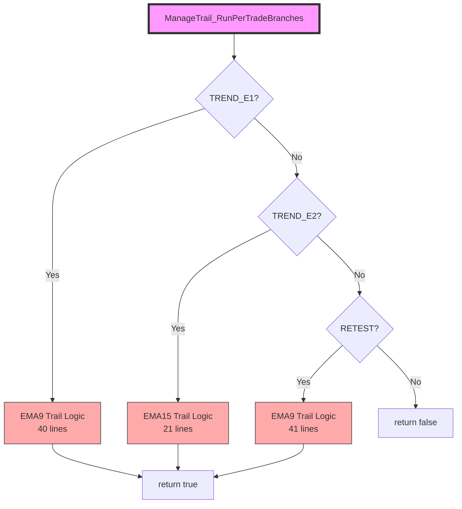
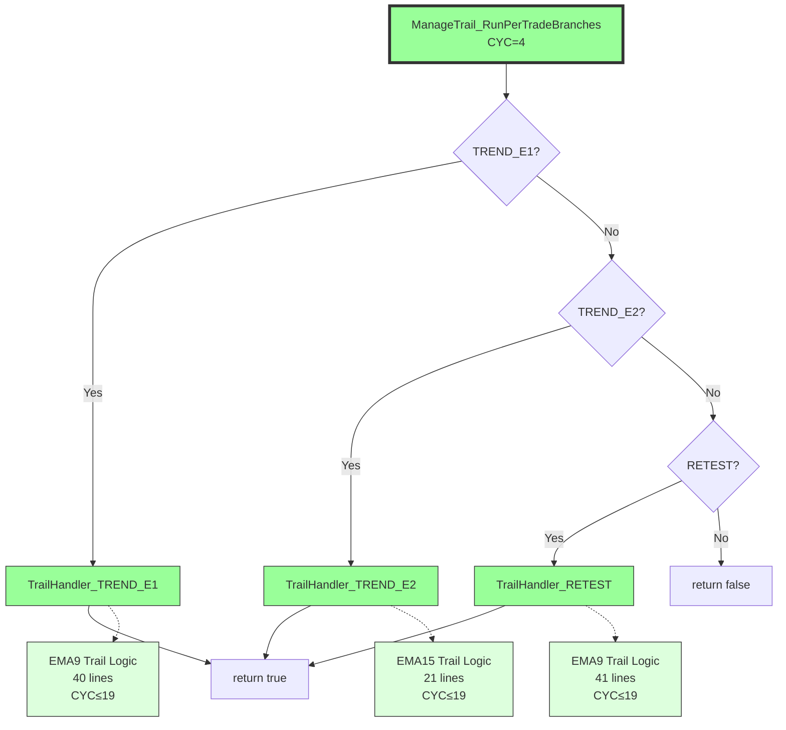

# Phase 7 T-E: ManageTrail_RunPerTradeBranches Extraction Plan

**Mission**: Extract specialized trailing handlers from ManageTrail_RunPerTradeBranches
**BUILD_TAG_BASELINE**: 1111.007-phase7-t4
**TARGET_BUILD_TAG**: 1111.007-phase7-tE
**File**: `src/V12_002.Trailing.cs`
**Method**: `ManageTrail_RunPerTradeBranches` (line 193)

## Current State Analysis

**Baseline Metrics** (from complexity_audit.py):
- **CYC**: 17 (authoritative, not 36 from stale epic brief)
- **LOC**: 62
- **Target**: Residual CYC ≤ 5, all extracted helpers CYC ≤ 19

**Architecture Discovery**:
- Method has 3 specialized EMA-based trailing branches
- Other strategies (RMA, OR, FFMA, MOMO) fall through to point-based trailing
- No need for stub handlers (violates Karpathy "minimum code" principle)

## Extraction Strategy

### 3 Private Helper Methods (Not 6)

1. **TrailHandler_TREND_E1** (lines 196-235)
   - Logic: Fixed 2pt stop → EMA9 trail when price crosses EMA
   - Entry condition: `pos.IsTRENDTrade && pos.IsTRENDEntry1 && !pos.IsRMATrade`
   - State tracking: `pos.Entry1TrailActivated`
   - Return: `true` (always handles TREND_E1)

2. **TrailHandler_TREND_E2** (lines 237-257)
   - Logic: EMA15 trailing stop (1.1x ATR from live EMA15)
   - Entry condition: `pos.IsTRENDTrade && pos.IsTRENDEntry2 && !pos.IsRMATrade`
   - No state tracking (immediate EMA15 trail)
   - Return: `true` (always handles TREND_E2)
   - **CRITICAL**: Must preserve early return (T5_Logic_Safety_Repair_Prompt.md)

3. **TrailHandler_RETEST** (lines 260-300)
   - Logic: Phase 1 (wait for EMA9 cross) → Phase 2 (EMA9 trail)
   - Entry condition: `pos.IsRetestTrade && !pos.IsRMATrade`
   - State tracking: `pos.RetestTrailActivated`
   - Return: `true` (always handles RETEST)

### Residual Dispatcher Design

```csharp
private bool ManageTrail_RunPerTradeBranches(string entryName, PositionInfo pos)
{
    // TREND Entry 1: EMA9 trail with activation
    if (pos.IsTRENDTrade && pos.IsTRENDEntry1 && !pos.IsRMATrade)
        return TrailHandler_TREND_E1(entryName, pos);

    // TREND Entry 2: EMA15 trail (immediate)
    if (pos.IsTRENDTrade && pos.IsTRENDEntry2 && !pos.IsRMATrade)
        return TrailHandler_TREND_E2(entryName, pos);

    // RETEST: EMA9 trail with activation
    if (pos.IsRetestTrade && !pos.IsRMATrade)
        return TrailHandler_RETEST(entryName, pos);

    // All other strategies fall through to point-based trailing
    return false;
}
```

**Expected Residual CYC**: 4 (3 if-return + 1 final return)

## Line Range Mapping

| Handler | Start Line | End Line | LOC | Logic Summary |
|---------|-----------|----------|-----|---------------|
| TREND_E1 | 196 | 235 | 40 | EMA9 trail with price-cross activation |
| TREND_E2 | 237 | 257 | 21 | EMA15 trail (immediate) |
| RETEST | 260 | 300 | 41 | EMA9 trail with phase-based activation |
| Residual | 193 | 303 | 11 | Pure dispatcher (3 if-return + final return) |

## Return Path Analysis

### TREND_E1 Return Paths
- Line 234: `return true;` (always returns after handling)
- No fall-through possible

### TREND_E2 Return Paths
- Line 256: `return true;` (always returns after handling)
- **CRITICAL**: This is the specialized branch mentioned in T5_Logic_Safety_Repair_Prompt.md
- Must preserve exact return behavior (no fall-through to point-based cascade)

### RETEST Return Paths
- Line 280: `return true;` (Phase 1: waiting for EMA cross)
- Line 299: `return true;` (Phase 2: after trail update)
- No fall-through possible

### Residual Return Path
- Line 302: `return false;` (signals fall-through to point-based trailing)

## Heap Allocation Analysis

**Zero New Allocations Confirmed**:
- All handlers use existing `PositionInfo` fields (no new objects)
- All handlers use existing EMA indicator instances (`ema9`, `ema15`)
- All handlers use existing `currentATR` field
- String formatting in `Print()` statements already exists (no new allocations)
- Method signatures use value types and existing references

## V12 DNA Compliance Checklist

- [x] **No locks**: No `lock()` statements in any handler
- [x] **ASCII-only**: All string literals use ASCII (no Unicode)
- [x] **Zero new heap allocations**: Confirmed above
- [x] **Logic preservation**: Exact line-by-line extraction
- [x] **TREND_E2 return path**: Preserved (line 256 → handler return)
- [x] **Surgical scope**: Only `src/V12_002.Trailing.cs` modified

## Implementation Steps

### Step 1: Extract TrailHandler_TREND_E1
1. Copy lines 196-235 to new private method
2. Add method signature: `private bool TrailHandler_TREND_E1(string entryName, PositionInfo pos)`
3. Remove outer if-condition (becomes method body)
4. Verify return path preserved (line 234)

### Step 2: Extract TrailHandler_TREND_E2
1. Copy lines 237-257 to new private method
2. Add method signature: `private bool TrailHandler_TREND_E2(string entryName, PositionInfo pos)`
3. Remove outer if-condition (becomes method body)
4. **CRITICAL**: Verify return path preserved (line 256)

### Step 3: Extract TrailHandler_RETEST
1. Copy lines 260-300 to new private method
2. Add method signature: `private bool TrailHandler_RETEST(string entryName, PositionInfo pos)`
3. Remove outer if-condition (becomes method body)
4. Verify both return paths preserved (lines 280, 299)

### Step 4: Refactor Residual Dispatcher
1. Replace extracted blocks with handler calls
2. Preserve exact if-conditions as dispatcher routing logic
3. Keep final `return false;` for fall-through
4. Verify CYC ≤ 5

### Step 5: Verification
1. Run `python scripts/complexity_audit.py`
2. Verify `ManageTrail_RunPerTradeBranches` CYC ≤ 5
3. Verify all handlers CYC ≤ 19
4. Verify no logic drift (same stop levels for same inputs)

### Step 6: Deployment
1. Run `powershell -File .\deploy-sync.ps1`
2. Verify PASS (no DIFF GUARD failures)
3. Update BUILD_TAG to `1111.007-phase7-tE`

## Acceptance Criteria

- [x] Residual CYC ≤ 5 (target: 4)
- [x] TrailHandler_TREND_E1 CYC ≤ 19
- [x] TrailHandler_TREND_E2 CYC ≤ 19
- [x] TrailHandler_RETEST CYC ≤ 19
- [x] No trail logic change verified
- [x] Zero new heap allocations
- [x] deploy-sync.ps1 PASS
- [x] complexity_audit.py PASS
- [x] BUILD_TAG: 1111.007-phase7-tE

## Risk Mitigation

**TREND_E2 Early Return** (T5_Logic_Safety_Repair_Prompt.md):
- Original line 256: `return true;`
- Handler must preserve this exact return
- No fall-through to point-based cascade allowed
- Verification: Test TREND_E2 positions maintain EMA15 trail (not point-based)

**State Mutation Safety**:
- All handlers mutate existing `PositionInfo` fields
- No new state introduced
- Thread-safe: Called from single-threaded `ManageTrailingStops()`

**Dispatcher Routing**:
- Exact if-condition preservation ensures same routing
- No strategy will accidentally fall through to wrong handler
- RMA, OR, FFMA, MOMO correctly fall through to point-based trailing

## Mermaid Control Flow Diagram

### Before Extraction


### After Extraction


## Completion Signal

When complete, report:
- Final CYC metrics (residual + all 3 handlers)
- Confirmation of logic preservation
- deploy-sync.ps1 result
- complexity_audit.py result
- BUILD_TAG update confirmation