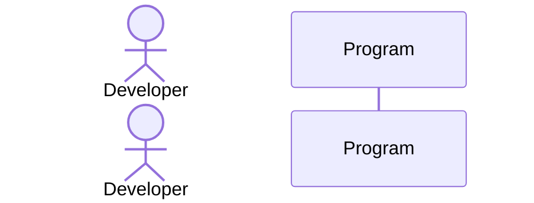

# PR #6 Forensics Report
Generated: 2026-05-23 11:22:11

## Summary

| Metric | Count |
|--------|-------|
| Total Findings | 24 |
| VALID Issues | 17 |
| HALLUCINATIONS | 0 |
| INFRA-NOISE | 7 |
| P0 (Critical) | 13 |
| P1 (High) | 4 |
| P2 (Medium) | 7 |

## VALID Issues (Priority Order)

### [P0] CRITICAL - coderabbitai
**Source:** review  
**Timestamp:** 2026-05-23T15:18:32Z  
**URL:** https://github.com/mdasdispatch-hash/universal-or-strategy/pull/6

**Excerpt:**
```
**Actionable comments posted: 9**

<details>
<summary>­ƒñû Prompt for all review comments with AI agents</summary>

```
Verify each finding against current code. Fix only still-valid issues, skip the
rest with a brief reason, keep changes minimal, and validate.

Inline comments:
In `@benchmarks/BarUpdateBenchmark.cs`:
- Line 14: The class BarUpdateBenchmark violates the required V12 prefix
convention; rename the primary class BarUpdateBenchmark to use the appropriate
V12 prefix (e.g., V12_001_Ba
```

### [P0] CRITICAL - codacy-production
**Source:** review  
**Timestamp:** 2026-05-23T15:16:25Z  
**URL:** https://github.com/mdasdispatch-hash/universal-or-strategy/pull/6

**Excerpt:**
```
### Pull Request Overview

The current PR fails to meet the core objective of 'locking in' performance gains because the benchmarks exercise mock properties and local re-implementations rather than production logic. This, combined with methodological errors like JIT dead-code elimination, constant folding, and suboptimal RunStrategies, means the resulting metrics will not reflect the real system's behavior. The PR analysis indicates it is not up to standards, with critical safety issues like blo
```

### [P0] CONCURRENCY - sourcery-ai
**Source:** review  
**Timestamp:** 2026-05-23T15:15:24Z  
**URL:** https://github.com/mdasdispatch-hash/universal-or-strategy/pull/6

**Excerpt:**
```
Hey - I've found 3 issues, and left some high level feedback:

- In `MockOrderTracker.CancelOrder`, the `Interlocked.CompareExchange` is operating on a local `currentState` value rather than shared state, so the compare/exchange is not actually atomic or preventing multiple successful cancellations; consider storing the state as an `int` field on `OrderData` (or a separate shared field) and performing `CompareExchange` directly against that field.
- The benchmarks currently depend on types from 
```

### [P0] CRITICAL - cubic-dev-ai
**Source:** review  
**Timestamp:** 2026-05-23T15:22:18Z  
**URL:** https://github.com/mdasdispatch-hash/universal-or-strategy/pull/6

**Excerpt:**
```
**6 issues found** across 9 files

<details>
<summary>Prompt for AI agents (unresolved issues)</summary>

```text

Check if these issues are valid ÔÇö if so, understand the root cause of each and fix them. If appropriate, use sub-agents to investigate and fix each issue separately.


<file name="benchmarks/V12_Performance.Benchmarks.csproj">

<violation number="1" location="benchmarks/V12_Performance.Benchmarks.csproj:16">
P2: Benchmark project references the test project, pulling in xunit, test
```

### [P0] CRITICAL - coderabbitai
**Source:** review  
**Timestamp:** 2026-05-23T17:00:49Z  
**URL:** https://github.com/mdasdispatch-hash/universal-or-strategy/pull/6

**Excerpt:**
```
**Actionable comments posted: 1**

<details>
<summary>­ƒñû Prompt for all review comments with AI agents</summary>

```
Verify each finding against current code. Fix only still-valid issues, skip the
rest with a brief reason, keep changes minimal, and validate.

Inline comments:
In `@tests/V12_Performance.Tests/Core/OrderManagementTests.cs`:
- Around line 199-203: Make the StateInt backing field private on OrderData and
encapsulate the atomic transition by adding a method like TryCancel() or
Try
```

### [P0] CRITICAL - cubic-dev-ai
**Source:** review  
**Timestamp:** 2026-05-23T16:36:11Z  
**URL:** https://github.com/mdasdispatch-hash/universal-or-strategy/pull/6

**Excerpt:**
```
**1 issue found across 1 file (changes from recent commits).**

<details>
<summary>Prompt for AI agents (unresolved issues)</summary>

```text

Check if these issues are valid ÔÇö if so, understand the root cause of each and fix them. If appropriate, use sub-agents to investigate and fix each issue separately.


<file name="Linting.csproj">

<violation number="1" location="Linting.csproj:9">
P2: Adding `<OutputType>Library</OutputType>` without re-adding `<IsPackable>false</IsPackable>` (which w
```

### [P0] CRITICAL - cubic-dev-ai
**Source:** review  
**Timestamp:** 2026-05-23T16:18:57Z  
**URL:** https://github.com/mdasdispatch-hash/universal-or-strategy/pull/6

**Excerpt:**
```
**2 issues found across 1 file (changes from recent commits).**

<details>
<summary>Prompt for AI agents (unresolved issues)</summary>

```text

Check if these issues are valid ÔÇö if so, understand the root cause of each and fix them. If appropriate, use sub-agents to investigate and fix each issue separately.


<file name="tests/V12_Performance.Tests/Core/OrderManagementTests.cs">

<violation number="1" location="tests/V12_Performance.Tests/Core/OrderManagementTests.cs:205">
P0: [CRITICAL-JS-V
```

### [P0] CRITICAL - gemini-code-assist
**Source:** review  
**Timestamp:** 2026-05-23T15:15:23Z  
**URL:** https://github.com/mdasdispatch-hash/universal-or-strategy/pull/6

**Excerpt:**
```
## Code Review

This pull request adds a performance benchmarking and unit testing framework for the V12 project, including BenchmarkDotNet harnesses for hot paths and Xunit tests for lock-free Actor and order management logic. Review feedback highlights a critical bug in the order cancellation implementation where atomic operations were incorrectly applied to local variables, and identifies a test logic error caused by struct copy semantics. Further recommendations include implementing defensiv
```

### [P0] CRITICAL - sourcery-ai
**Source:** comment  
**Timestamp:** 2026-05-23T15:13:42Z  
**URL:** https://github.com/mdasdispatch-hash/universal-or-strategy/pull/6#issuecomment-4525772213

**Excerpt:**
```
<!-- Generated by sourcery-ai[bot]: start review_guide -->

## Reviewer's Guide

Introduces a dedicated performance testing infrastructure by adding BenchmarkDotNet harnesses for core hot paths, lockÔÇæfree unit tests around FSM/actor and order management patterns, and zeroÔÇæallocation NinjaTrader API mocks, all wired through new test and benchmark projects.

#### Sequence diagram for running Benchmarks via Program.Main



### [P0] CRITICAL - codacy-production
**Source:** comment  
**Timestamp:** 2026-05-23T15:14:14Z  
**URL:** https://github.com/mdasdispatch-hash/universal-or-strategy/pull/6#issuecomment-4525773431

**Excerpt:**
```
## Not up to standards Ôøö
<details><summary><strong>­ƒö┤ Issues</strong>  <code>6 critical ┬À 1 high ┬À 27 medium</code></summary>

> <br/>
>
> 
> **Alerts:**
> ÔÜá 34 issues (Ôëñ 0 issues of at least minor severity)
> 
>
> **Results:**
> `34` new issues
>
> | Category | Results |
> | ------------- | ------------- |
> | Compatibility | `7` medium  | 
 > | UnusedCode | `9` medium  | 
 > | BestPractice | `7` medium  | 
 > | ErrorProne | `6` critical <br/> `1` high  | 
 > | Performance | `4` mediu
```

### [P0] CRITICAL - coderabbitai
**Source:** comment  
**Timestamp:** 2026-05-23T15:13:48Z  
**URL:** https://github.com/mdasdispatch-hash/universal-or-strategy/pull/6#issuecomment-4525772437

**Excerpt:**
```
<!-- This is an auto-generated comment: summarize by coderabbit.ai -->
<!-- walkthrough_start -->

<details>
<summary>­ƒôØ Walkthrough</summary>

## Walkthrough

Adds a benchmark harness, three BenchmarkDotNet benchmark classes, mock NinjaTrader types, and concurrent xUnit tests to exercise hot paths and concurrency behaviors.

## Changes

**Performance Testing and Benchmarking Infrastructure**

|Layer / File(s)|Summary|
|---|---|
|**Mock type contracts and implementations** <br> `tests/V12_Perf
```

### [P0] CRITICAL - amazon-q-developer
**Source:** review  
**Timestamp:** 2026-05-23T15:14:32Z  
**URL:** https://github.com/mdasdispatch-hash/universal-or-strategy/pull/6

**Excerpt:**
```
## Critical Issues Found - Blocking Merge

This PR contains fundamental logic errors in the test implementation that undermine the lock-free guarantees being tested:

**Critical Defects:**
1. **Struct Copy Semantics Bug** (Lines 30, 52): Tests modify struct copies instead of originals, invalidating state transition validation
2. **Broken Atomic Operations** (Lines 199-211): `CompareExchange` on local variable instead of struct field, creating race conditions
3. **Non-Atomic State Updates** (Line
```

### [P0] CRITICAL - codacy-production
**Source:** comment  
**Timestamp:** 2026-05-23T16:58:39Z  
**URL:** https://github.com/mdasdispatch-hash/universal-or-strategy/pull/6#issuecomment-4526007362

**Excerpt:**
```
## Not up to standards Ôøö
<details><summary><strong>­ƒö┤ Issues</strong>  <code>6 critical ┬À 1 high ┬À 27 medium</code></summary>

> <br/>
>
> 
> **Alerts:**
> ÔÜá 34 issues (Ôëñ 0 issues of at least minor severity)
> 
>
> **Results:**
> `34` new issues
>
> | Category | Results |
> | ------------- | ------------- |
> | Compatibility | `7` medium  | 
 > | UnusedCode | `9` medium  | 
 > | BestPractice | `7` medium  | 
 > | ErrorProne | `6` critical <br/> `1` high  | 
 > | Performance | `4` mediu
```

### [P1] REVIEW - coderabbitai
**Source:** review  
**Timestamp:** 2026-05-23T16:17:30Z  
**URL:** https://github.com/mdasdispatch-hash/universal-or-strategy/pull/6

**Excerpt:**
```
**Actionable comments posted: 2**

<details>
<summary>­ƒñû Prompt for all review comments with AI agents</summary>

```
Verify each finding against current code. Fix only still-valid issues, skip the
rest with a brief reason, keep changes minimal, and validate.

Inline comments:
In `@Linting.csproj`:
- Around line 16-17: The project disables compilation so no Linting.dll is
produced (SkipCompilerExecution=true plus EnableDefaultCompileItems=false and no
Compile items), breaking CI and preventing
```

### [P1] REVIEW - coderabbitai
**Source:** review  
**Timestamp:** 2026-05-23T16:35:25Z  
**URL:** https://github.com/mdasdispatch-hash/universal-or-strategy/pull/6

**Excerpt:**
```


<details>
<summary>ÔÖ╗´©Å Duplicate comments (1)</summary><blockquote>

<details>
<summary>Linting.csproj (1)</summary><blockquote>

`24-27`: _ÔÜá´©Å Potential issue_ | _­ƒƒá Major_ | _ÔÜí Quick win_

**Linting project is configured to analyze zero repo sources.**

At Line 25, the `ItemGroup` has no `Compile` items while `EnableDefaultCompileItems` is disabled, so analyzers wonÔÇÖt evaluate real code files during `dotnet build Linting.csproj`.

<details>
<summary>Suggested minimal fix</summary
```

### [P1] SECURITY - pr-insights-tagger
**Source:** comment  
**Timestamp:** 2026-05-23T16:56:47Z  
**URL:** https://github.com/mdasdispatch-hash/universal-or-strategy/pull/6#issuecomment-4526003745

**Excerpt:**
```
## PR Analysis Summary

<div align="center">

<!-- Badges for GitHub web view -->
  

<!-- Text fallback for email notifications -->
<details>
<summary><sub>­ƒôº Email-friendly summary</sub></summary>
<br>
<strong>Risk:</strong> ­ƒö┤ High Risk | <stron
```

### [P1] SECURITY - pr-insights-tagger
**Source:** comment  
**Timestamp:** 2026-05-23T16:31:45Z  
**URL:** https://github.com/mdasdispatch-hash/universal-or-strategy/pull/6#issuecomment-4525945322

**Excerpt:**
```
## PR Analysis Summary

<div align="center">

<!-- Badges for GitHub web view -->
  

<!-- Text fallback for email notifications -->
<details>
<summary><sub>­ƒôº Email-friendly summary</sub></summary>
<br>
<strong>Risk:</strong> ­ƒö┤ High Risk | <stron
```

## INFRA-NOISE (Ignored)
- **codeslick-security-scanner**: INFRA
- **codeslick-security-scanner**: INFRA
- **insight-code-accessibility**: INFRA
- **codeslick-security-scanner**: INFRA
- **insight-code-accessibility**: INFRA
- **codeslick-security-scanner**: INFRA
- **insight-code-accessibility**: INFRA

